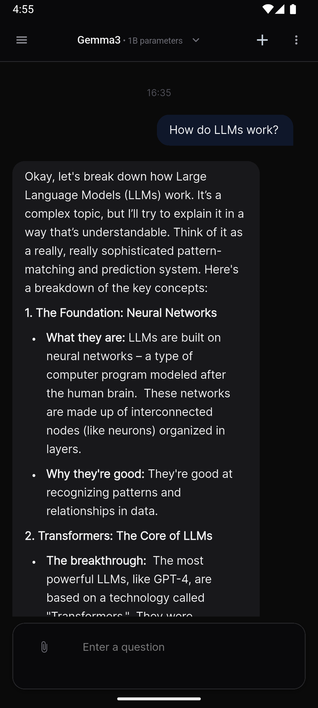
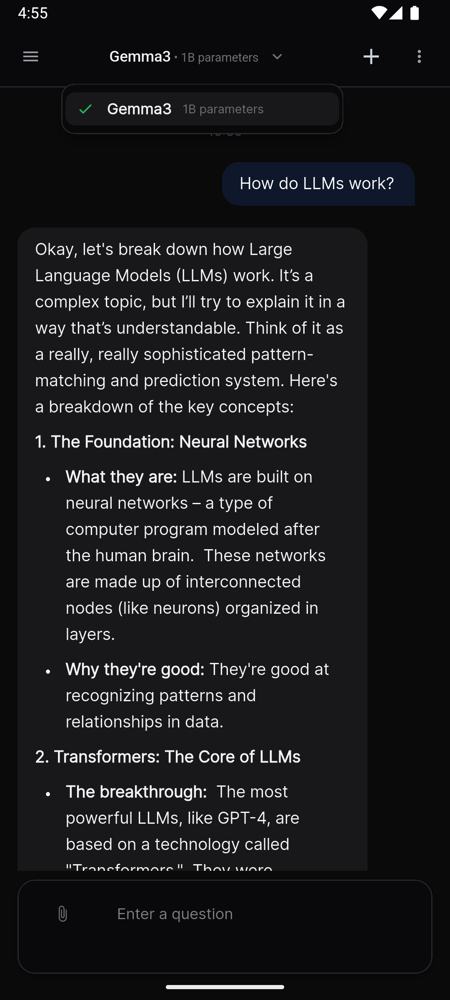
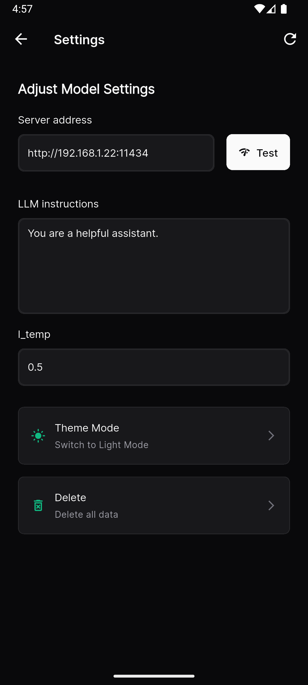
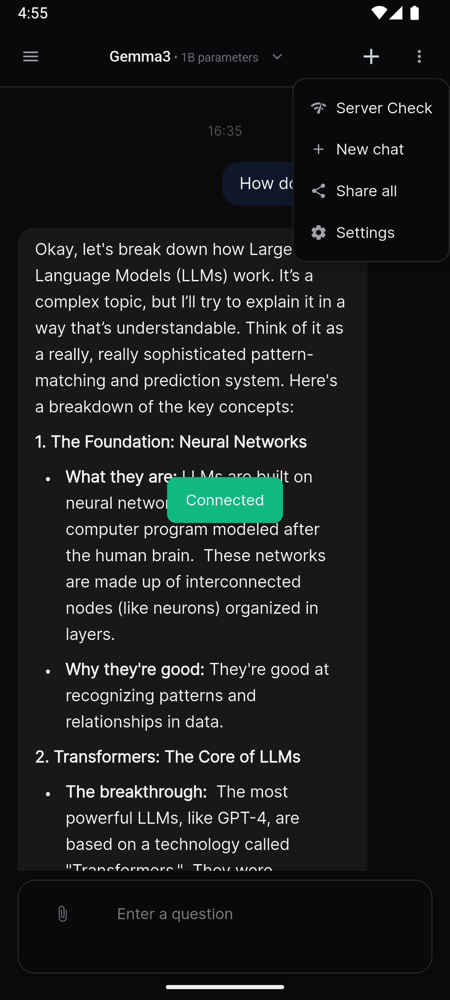
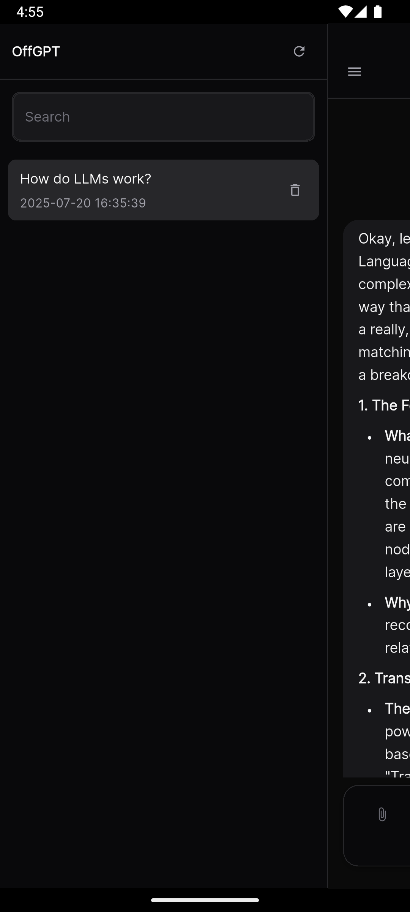

# OffGPT - Flutter Ollama Chat Client

<div align="center">
  
</div>

OffGPT is a modern, cross-platform chat application built with Flutter that allows you to interact with local AI models through Ollama. Experience the power of AI conversations with a beautiful, intuitive interface while keeping your data completely private and offline.

## ✨ Features

- 🤖 **Local AI Models** - Connect to locally running Ollama models
- 💬 **Beautiful Chat UI** - Modern, responsive chat interface
- 🎨 **Dark/Light Theme** - Seamless theme switching
- 📱 **Cross-Platform** - Works on iOS, Android, macOS, and Web
- 🔒 **Privacy First** - All conversations stay on your device
- 🌍 **Multi-Language** - Support for multiple languages
- ⚙️ **Customizable** - Adjust temperature, instructions, and more
- 📋 **Chat Management** - Save, organize, and export conversations

## 📱 Screenshots

<div align="center">

### Main Chat Interface



### Enhanced Model Selection



### Settings Configuration



### Initial Setup



### Dark Theme



</div>

## 🚀 Quick Start

### Prerequisites

1. **Install Ollama** on your computer:

   - Visit [ollama.ai](https://ollama.ai) and download Ollama for your operating system
   - Follow the installation instructions for your platform

2. **Download a Model** using Ollama:
   ```bash
   # Popular models you can try:
   ollama pull llama3.2        # Meta's Llama 3.2
   ollama pull gemma2          # Google's Gemma 2
   ollama pull mistral         # Mistral 7B
   ollama pull codellama       # Code-focused model
   ```

### Setup Instructions

#### Step 1: Configure Ollama for Network Access

1. **Enable External Access** in Ollama:

   - Open Ollama settings/preferences
   - Look for "Allow network connections" or "Expose to network" option
   - **Check the box** to enable external access
   - Restart Ollama if prompted

2. **Find Your IP Address**:

   **On Windows:**

   ```cmd
   ipconfig
   ```

   Look for "IPv4 Address" under your active network adapter

   **On macOS/Linux:**

   ```bash
   ifconfig
   ```

   or

   ```bash
   ip addr show
   ```

   Look for your local IP (usually starts with 192.168.x.x or 10.x.x.x)

#### Step 2: Install and Configure OffGPT

1. **Download OffGPT** for your platform from the releases page

2. **Launch the app** and go to Settings

3. **Configure Server Connection**:

   - Enter your IP address in the "Server Address" field
   - Format: `http://YOUR_IP_ADDRESS:11434`
   - Example: `http://192.168.1.100:11434`
   - Tap the "Test" button to verify connection

4. **Select Your Model**:
   - Once connected, available models will appear in the dropdown
   - Select your preferred model from the list
   - The app will display the model name and parameter count (e.g., "Gemma3 • 1B parameters")

#### Step 3: Start Chatting!

- Return to the main chat screen
- Start typing your questions or prompts
- Enjoy natural conversations with your local AI model

## ⚙️ Configuration Options

### Settings Menu

- **Server Address**: Your Ollama server URL
- **Instructions**: System prompt to customize AI behavior
- **Temperature**: Controls response creativity (0.0 = focused, 1.0 = creative)
- **Theme**: Switch between light and dark modes
- **Language**: Change app interface language

### Model Display

The app intelligently displays model information:

- **Model Name**: Properly formatted (e.g., "Gemma3", "Llama3.2", "CodeLlama")
- **Parameters**: Human-readable parameter count (e.g., "7B parameters", "1.3T parameters")

## 🛠️ Development

### Requirements

- Flutter SDK 3.5.4+
- Dart SDK
- Platform-specific development tools (Xcode for iOS, Android Studio for Android)

### Building from Source

1. **Clone the repository**:

   ```bash
   git clone https://github.com/Arjun6112/off_gpt-flutter.git
   cd off_gpt-flutter
   ```

2. **Install dependencies**:

   ```bash
   flutter pub get
   ```

3. **Run the app**:
   ```bash
   flutter run
   ```

### Project Structure

```
lib/
├── main.dart              # App entry point
├── models/               # Data models
├── provider/             # State management
├── services/             # API and business logic
├── views/                # UI screens
├── widgets/              # Reusable components
├── helpers/              # Utilities and helpers
└── theme/                # App theming
```

### Common Issues

**Can't connect to Ollama server:**

- Verify Ollama is running on your computer
- Check that "Expose to network" is enabled in Ollama settings
- Ensure your IP address is correct
- Try using `http://localhost:11434` if running on the same device

**No models available:**

- Make sure you've downloaded at least one model using `ollama pull <model_name>`
- Verify the connection to Ollama server is working
- Check Ollama logs for any errors

**App crashes or performance issues:**

- Ensure you have sufficient RAM for the selected model
- Try using a smaller model if experiencing slowdowns
- Check device storage and free up space if needed

## 🔗 Links

- [Ollama Official Website](https://ollama.ai)
- [Flutter Documentation](https://flutter.dev)
- [Report Issues](https://github.com/Arjun6112/off_gpt-flutter/issues)

---

Made with ❤️ using Flutter and Ollama
